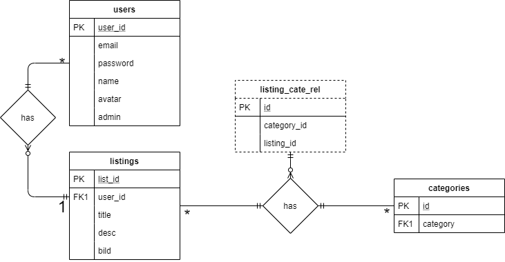

# Projektplan

## 1. Projektbeskrivning (Beskriv vad sidan ska kunna göra)
## 2. Vyer (visa bildskisser på dina sidor)
## 3. Databas med ER-diagram (Bild)

## 4. Arkitektur (Beskriv filer och mappar - vad gör/inehåller de?)
│   .byebug_history\
│   app.rb\
* innehåller alla routes \
│   gemfile\
│   gemfile.lock\
│   model.rb\
* innehåller all databaskod \
│\
├───.yardoc\
│\
├───db\
* innehåller databasen \
│       database.db\
│       database.db.sqbpro\
│\
├───doc\
* innehåller all docs \
├───public\
│   ├───css\
* innehåller css \
│   │\
│   ├───img\
* innehåller alla bilder \
│   └───js\
└───views\
    │   error.slim\
    │   index.slim\
    │   layout.slim\
    │\
    ├───users\
    * innehåller alla slim filer som har något med users att göra \
    │       adminsettings.slim\
    │       login.slim\
    │       profile.slim\
    │       register.slim\
    │\
    └───webshop\
    * innehåller alla slim filer som har något med själva webshopen att göra \
            createlisting.slim\
            update.slim\
            upload.slim\
            webshop.slim\
