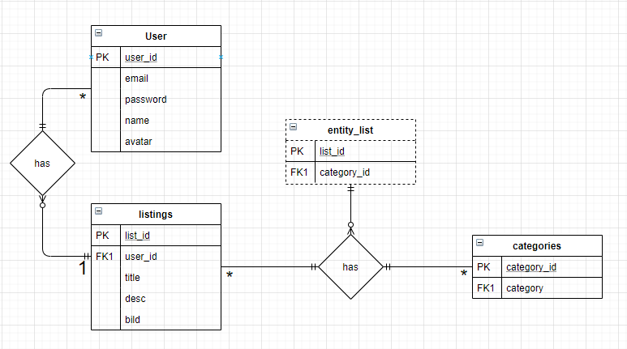

# Projektplan

## 1. Projektbeskrivning (Beskriv vad sidan ska kunna göra)
## 2. Vyer (visa bildskisser på dina sidor)
## 3. Databas med ER-diagram (Bild)

## 4. Arkitektur (Beskriv filer och mappar - vad gör/inehåller de?)
├───.yardoc\
│   └───objects\
├───db\
    database.db\
        innehåller all information i databasen\
├───doc\
│   ├───css\
│   └───js\
├───public\
│   ├───css\
│   ├───img\
│   └───js\
└───views\
    ├───users\
    └───webshop\
app.rb\
model.rb
